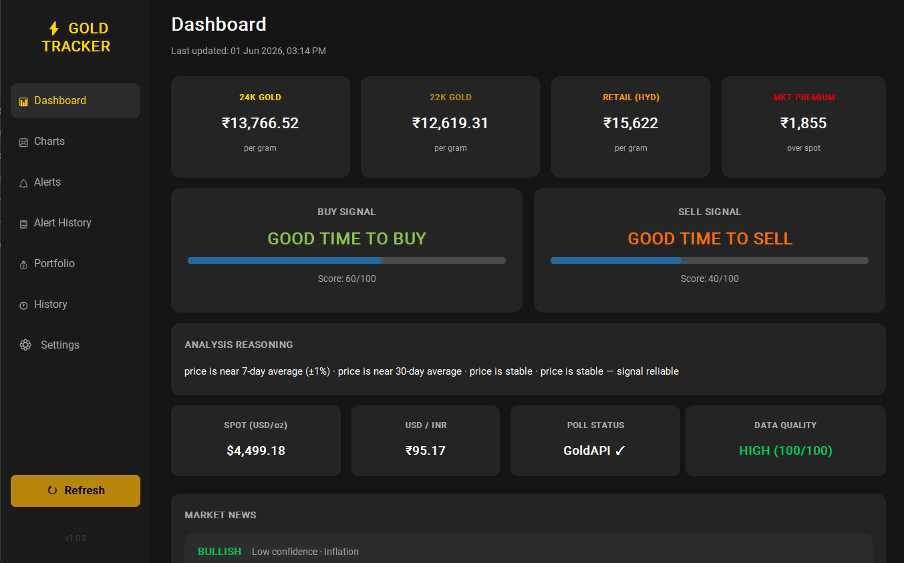
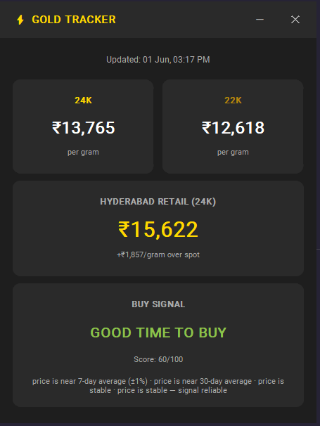

# ⚡ GoldTracker

A Windows desktop application that tracks live gold prices for Indian
markets with intelligent buy/sell signals, target price alerts, and
silent system tray integration.


---

## Features

- 📊 **Live Prices** — 24K and 22K gold updated every 5 minutes
- 🏙️ **City-Specific Retail Rates** — Hyderabad, Vijayawada, Mumbai and more
- 🧠 **Intelligent Buy/Sell Signals** — scored using moving averages, momentum, and volatility
- 🔔 **Target Price Alerts** — Windows notifications when your price is hit
- 📈 **Price History Charts** — 24H, 7D, 30D views
- 🔲 **System Tray Integration** — runs silently in background
- 🚀 **Auto-Launch on Startup** — starts with Windows automatically
- 💾 **Local SQLite Storage** — all history stored privately on your machine
- 💰 **Portfolio Tracker** — log purchases, track real-time P&L per holding
- 📋 **Alert History** — view all active, triggered and cancelled alerts
- 📰 **News Correlation** — live market news with Bullish/Bearish/Neutral sentiment
- 📊 **Weekly Summary** — Sunday morning digest of the week's gold performance
- 🛡️ **Anomaly Detection** — validates every reading, rejects bad data automatically
- 🔍 **Data Quality Score** — live confidence indicator on dashboard

---

## Screenshots

### Dashboard


### Startup Popup


---

## Data Sources

| Source | Role | API Key Required |
|--------|------|-----------------|
| [gold-api.com](https://api.gold-api.com) | International spot price (primary) | No |
| [GoldAPI.io](https://goldapi.io) | Spot price fallback | Yes (free, optional) |
| [Frankfurter API](https://api.frankfurter.dev) | Live USD/INR conversion | No |
| [GoodReturns.in](https://goodreturns.in) | Indian city retail rates | No |
| [GNews API](https://gnews.io) | Gold market news headlines | Yes (free) |

> gold-api.com is the primary spot price source — no API key or rate limits.
> GoldAPI.io activates automatically as fallback (100 req/month free tier).

---

## Tech Stack

| Layer | Technology |
|-------|-----------|
| UI | CustomTkinter |
| Database | SQLite3 |
| HTTP | requests |
| Scraping | BeautifulSoup4 + lxml |
| Scheduling | Python threading |
| Notifications | plyer + winsound |
| System Tray | pystray |
| Packaging | PyInstaller |

---

## Setup

### Prerequisites
- Windows 10 or 11
- Python 3.9+
- Free API key from [gnews.io](https://gnews.io) — for news features
- Optional: Free API key from [goldapi.io](https://goldapi.io) — fallback only

### Installation

```bash
# Clone the repository
git clone https://github.com/harsha-vardhan-burra/GoldTracker.git
cd GoldTracker

# Create virtual environment
python -m venv venv
venv\Scripts\activate

# Install dependencies
pip install -r requirements.txt

# Set up config
copy config\settings.example.json config\settings.json
# Edit config\settings.json — add your gnews_api_key
```

### Run

```bash
# Normal launch (full dashboard)
python main.py

# Startup mode (notification-style popup)
python main.py --startup
```

---

## Project Structure

```
GoldTracker/
├── core/
│   ├── data_engine.py      # Fetches from 3 live data sources
│   ├── analytics.py        # Buy/sell scoring engine
│   ├── scheduler.py        # Background polling every 5 mins
│   ├── alert_engine.py     # Target alerts + spike detection
│   ├── news_engine.py      # News aggregation + sentiment analysis
│   ├── weekly_summary.py   # Sunday morning digest notification
│   └── anomaly_detector.py # Price validation + data quality scoring
├── database/
│   └── db_manager.py       # SQLite layer — all tables and queries
├── ui/
│   ├── dashboard.py        # Full 7-tab dashboard
│   ├── startup_popup.py    # Borderless notification-style popup
│   └── tray_icon.py        # System tray with right-click menu
├── utils/
│   └── startup_manager.py  # Windows startup registry
├── config/
│   └── settings.example.json
├── assets/
│   └── icon.ico
└── main.py                 # Entry point
```

---

## How the Buy/Sell Signal Works

The scoring engine analyses 4 signals every cycle:

| Signal | Weight | What it measures |
|--------|--------|-----------------|
| Price vs 7-day MA | 30pts | Short-term deviation from average |
| Price vs 30-day MA | 30pts | Medium-term deviation from average |
| Momentum | 25pts | Trend direction and speed |
| Volatility | 15pts | How reliable the signal is |

Score → Label mapping:

| Score | Buy Signal | Sell Signal |
|-------|-----------|-------------|
| 75–100 | Perfect time to buy | Bad time to sell |
| 55–74 | Good time to buy | Good time to sell |
| 35–54 | Wait a bit more | Hold for now |
| 0–34 | Bad time to buy | Perfect time to sell |

> Signals become meaningfully accurate after 7–30 days of continuous data collection.
> News sentiment is also factored into the explanation string each cycle.

---

## Data Integrity

Every price reading goes through validation before being stored:

- **Anomaly Detection** — rejects readings outside ₹5,000–₹30,000/gram range
- **Spike Detection** — rejects changes greater than 8% between 5-minute readings
- **Gap Handling** — marks offline periods in database so charts show honest breaks
- **Source Tracking** — every row records which API provided the data
- **Quality Score** — live HIGH/MEDIUM/LOW/POOR confidence shown on dashboard

---

## Important Notes

- `config/settings.json` is gitignored — your API keys are never committed
- All data stored locally — nothing leaves your machine
- App gets smarter over time — MA7 activates after 7 days, MA30 after 30 days
- Signals are analytical indicators, not financial advice

---

## License

MIT License — see [LICENSE](LICENSE) for details.

---

## Author

**Harsha Vardhan Burra**
[GitHub](https://github.com/harsha-vardhan-burra)