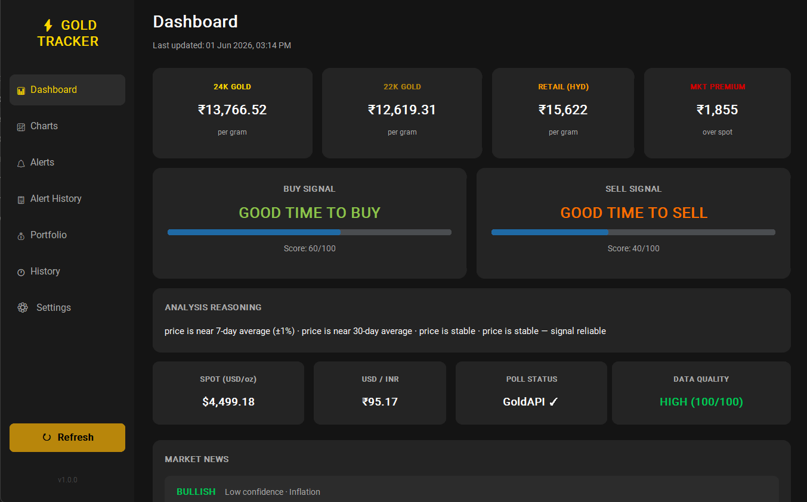
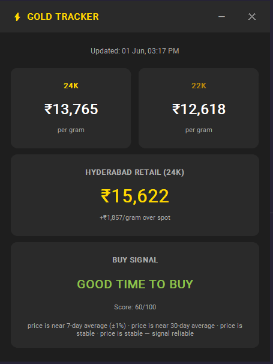
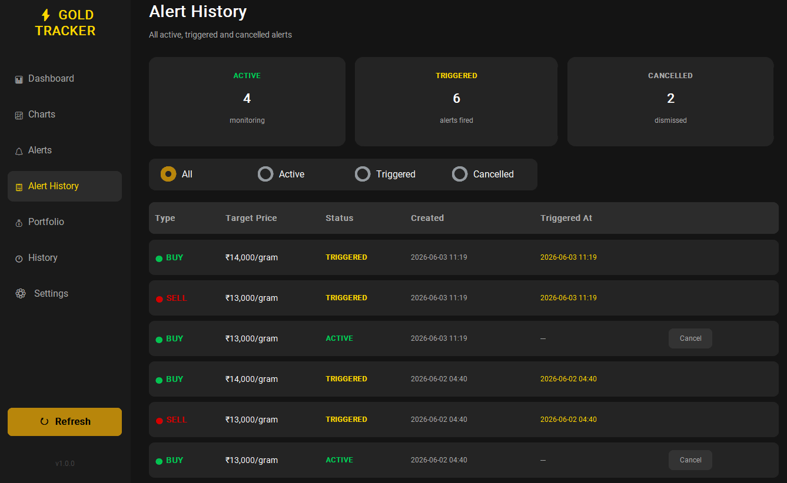
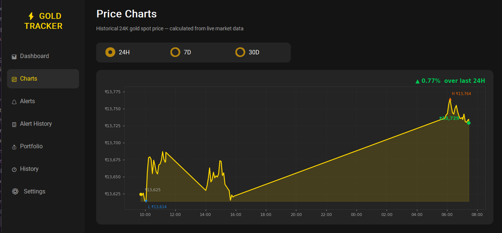
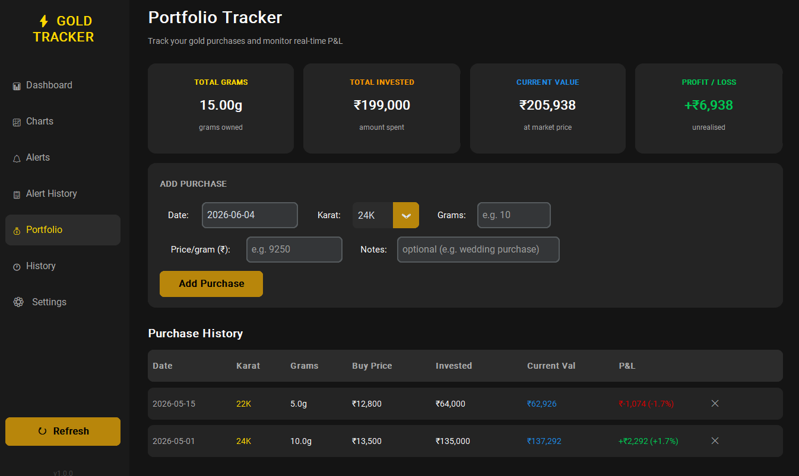

# ⚡ GoldTracker

A Windows desktop application that tracks live gold prices for Indian markets with intelligent buy/sell analytics, explainable reasoning, target price alerts, and silent system tray integration.

Unlike simple price trackers, GoldTracker continuously analyzes market conditions using multiple quantitative indicators, historical context, data quality validation, and explainable analytics to provide transparent buy/sell guidance.


---

## Features

* 📊 **Live Prices** — 24K and 22K gold updated every 5 minutes
* 🏙️ **City-Specific Retail Rates** — Hyderabad, Vijayawada, Mumbai and more
* 🧠 **Explainable Buy/Sell Signals** — multi-factor scoring engine with transparent reasoning
* 🔄 **Consistent Analytics Engine** — every refresh delivers a complete analytics payload without losing reasoning
* 🎯 **Confidence Rating** — dynamically communicates the reliability of each recommendation
* 🔔 **Target Price Alerts** — Windows notifications when your target price is reached
* 📈 **Price History Charts** — 24H, 7D and 30D visualizations
* 🔲 **System Tray Integration** — runs silently in the background
* 🚀 **Auto-Launch on Startup** — starts automatically with Windows
* 💾 **Local SQLite Storage** — all historical data remains on your machine
* 💰 **Portfolio Tracker** — track purchases and real-time profit/loss
* 📋 **Alert History** — review active, triggered and cancelled alerts
* 📰 **News Correlation** — live market news with Bullish/Bearish/Neutral sentiment
* 📊 **Weekly Summary** — Sunday morning digest of the week's gold performance
* 🛡️ **Anomaly Detection** — automatically rejects invalid market data
* 🔍 **Data Quality Score** — evaluates confidence in every live update
* ⏰ **Time-of-Day Awareness** — MCX and US market sessions influence signal confidence
* 📅 **Day-of-Week Patterns** — historical weekday behaviour incorporated into analysis
* 🎯 **Support & Resistance Detection** — historical price clustering identifies key levels
* 📈 **Trend Strength (ADX)** — Wilder-smoothed ADX measures trend conviction
* ⚙️ **Optimized Background Scheduler** — avoids unnecessary database writes while keeping analytics continuously updated

---

## Screenshots

### Dashboard



### Startup Popup



### Alert History



### Charts



### Portfolio



---

## Data Sources

| Source                                         | Role                               | API Key Required          |
| ---------------------------------------------- | ---------------------------------- | ------------------------- |
| [gold-api.com](https://gold-api.com)           | International spot price (primary) | No                        |
| [GoldAPI.io](https://goldapi.io)               | Spot price fallback                | Yes (optional, free tier) |
| [Frankfurter API](https://api.frankfurter.dev) | Live USD/INR conversion            | No                        |
| [GoodReturns.in](https://goodreturns.in)       | Indian city retail rates           | No                        |
| [GNews API](https://gnews.io)                  | Gold market news                   | Yes (free)                |

> **gold-api.com** serves as the primary spot price provider with no API key requirement or rate limits.
>
> **GoldAPI.io** is used automatically as a fallback when configured.

---

## Tech Stack

| Layer         | Technology            |
| ------------- | --------------------- |
| Language      | Python 3              |
| UI            | CustomTkinter         |
| Database      | SQLite3               |
| HTTP          | requests              |
| HTML Parsing  | BeautifulSoup4 + lxml |
| Charts        | matplotlib            |
| Scheduling    | Python threading      |
| Notifications | plyer + winsound      |
| System Tray   | pystray               |
| Packaging     | PyInstaller           |

---

## Setup

### Prerequisites

* Windows 10 or Windows 11
* Python 3.9+
* Free API key from **gnews.io** (required for news features)
* Optional free API key from **goldapi.io** (fallback provider)

### Installation

```bash
# Clone repository
git clone https://github.com/harsha-vardhan-burra/GoldTracker.git
cd GoldTracker

# Create virtual environment
python -m venv venv
venv\Scripts\activate

# Install dependencies
pip install -r requirements.txt

# Configure settings
copy config\settings.example.json config\settings.json

# Add your GNews API key
```

### Run

```bash
# Launch dashboard
python main.py

# Launch startup popup
python main.py --startup
```

---

## Project Structure

```text
GoldTracker/
├── core/
│   ├── data_engine.py          # Multi-source market data aggregation
│   ├── analytics.py            # Quantitative scoring & reasoning engine
│   ├── scheduler.py            # Background polling & analytics orchestration
│   ├── alert_engine.py         # Target alerts & spike detection
│   ├── news_engine.py          # News aggregation & sentiment analysis
│   ├── weekly_summary.py       # Weekly market digest
│   └── anomaly_detector.py     # Data validation & quality scoring
├── database/
│   └── db_manager.py           # SQLite storage layer
├── ui/
│   ├── dashboard.py            # Main application dashboard
│   ├── startup_popup.py        # Startup notification popup
│   └── tray_icon.py            # System tray integration
├── utils/
│   └── startup_manager.py      # Windows startup integration
├── config/
│   └── settings.example.json
├── assets/
│   └── icon.ico
└── main.py
```

---

## How the Buy/Sell Signal Works

GoldTracker combines multiple independent indicators into a unified quantitative scoring model.

| Signal                         | Points | Purpose                          |
| ------------------------------ | ------ | -------------------------------- |
| Price vs 7-Day Moving Average  | 0–30   | Short-term valuation             |
| Price vs 30-Day Moving Average | 0–30   | Medium-term valuation            |
| Momentum                       | 0–25   | Trend direction and acceleration |
| Volatility                     | 0–15   | Signal stability                 |
| Time-of-Day Modifier           | ±13    | Market session awareness         |
| Retail Premium Modifier        | ±10    | Spot vs retail divergence        |
| Trend Strength (ADX)           | ±5     | Trend conviction                 |
| Support / Resistance           | ±6     | Historical price zones           |

### Score Interpretation

| Score  | Buy Recommendation  | Sell Recommendation  |
| ------ | ------------------- | -------------------- |
| 75–100 | Perfect time to buy | Bad time to sell     |
| 55–74  | Good time to buy    | Good time to sell    |
| 35–54  | Wait a bit more     | Hold for now         |
| 0–34   | Bad time to buy     | Perfect time to sell |

Every recommendation is accompanied by a human-readable explanation describing the primary factors influencing the score, allowing users to understand *why* a recommendation was produced rather than relying on a black-box number.

> Moving-average based indicators become meaningful after 7–30 days of collected history.
>
> Support/resistance analysis becomes reliable after sufficient historical observations (approximately 20+ readings).
>
> ADX calculations require at least 28 historical observations.

---

## Data Integrity

Every market update passes through multiple validation stages before entering the analytics engine.

* ✅ Range validation rejects unrealistic prices
* ✅ Spike detection filters abnormal market jumps
* ✅ Gap tracking preserves honest chart history during offline periods
* ✅ Source attribution records the provider for every reading
* ✅ Live data quality scoring communicates confidence in the current dataset
* ✅ Scheduler optimization avoids duplicate database writes while maintaining complete analytics updates

---

## Analytics & Verification

GoldTracker's analytics engine follows a structured verification methodology to ensure consistency, transparency and maintainability.

Highlights include:

* Explainable reasoning accompanying every recommendation
* Deterministic scoring based on multiple quantitative indicators
* Confidence-aware recommendations
* Structured validation framework for analytics verification
* Consistent scheduler-to-dashboard analytics data contract
* Architecture designed for future historical replay and production validation

---

## Important Notes

* `config/settings.json` is ignored by Git to protect API keys.
* All market history is stored locally on your own machine.
* Analytics improve automatically as historical data accumulates.
* Recommendations are analytical indicators and should not be considered financial advice.

---

## License

MIT License — see [LICENSE](LICENSE).

---

## Author

**Harsha Vardhan Burra**

GitHub: https://github.com/harsha-vardhan-burra
